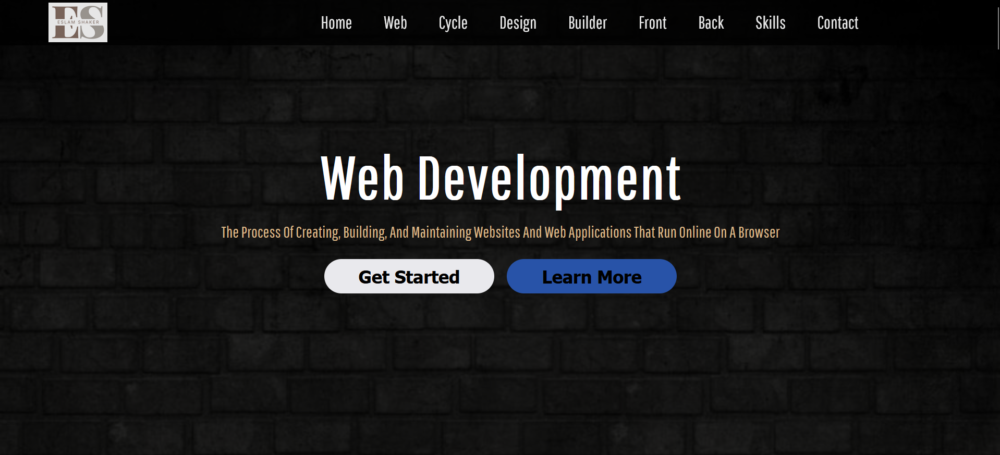

# Web Development Overview Page 🌐

This project is a simple and clean static web page built using **HTML** and **CSS**, showcasing fundamental information about **Web Development**. It serves as an informative layout to present static content in an organized and responsive design.

## 📌 Features

- ✅ Fully responsive layout
- ✅ Pure HTML & CSS implementation (No JavaScript)
- ✅ Informative content about Web Development
- ✅ Clean and readable code structure
- ✅ Beginner-friendly structure and design

## 🛠️ Technologies Used

- **HTML5**
- **CSS3**

## 📸 Preview

